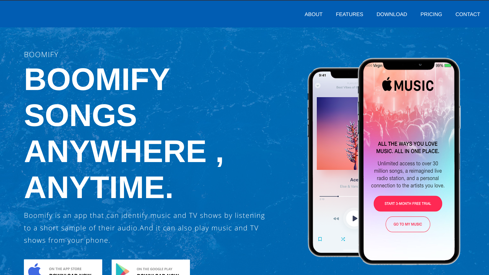
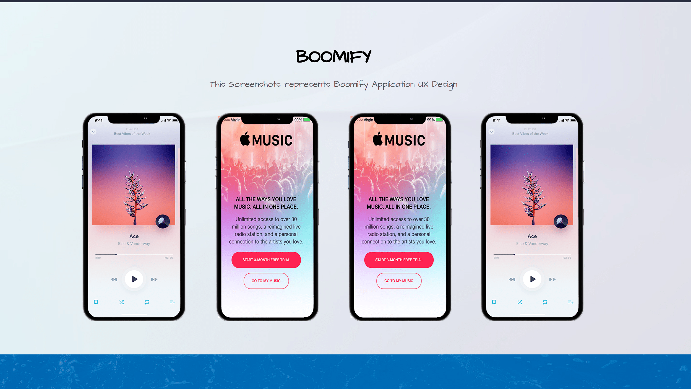

# Boomify Landing Page

This is a simple and responsive landing page for the Boomify project - a music discvery and player for the web and mobile.

  

  


## Getting Started

These instructions will get you a copy of the project up and running on your local machine for development and testing purposes. See deployment for notes on how to deploy the project on a live system.


### How to install

````
1. Clone the repository
2. Open the index.html file in your browser
3. Enjoy!
````

### How to contribute

````
1. Fork the repository
2. Create a new branch
3. Make your changes
4. Commit your changes
5. Push to the branch
6. Create a new Pull Request
````

#### Boomify Project is at the moment in development at the following repository:

## [Boomify](https://github.com/Joakim-animate90/boomify_app)

## License

This project is licensed under the MIT License.